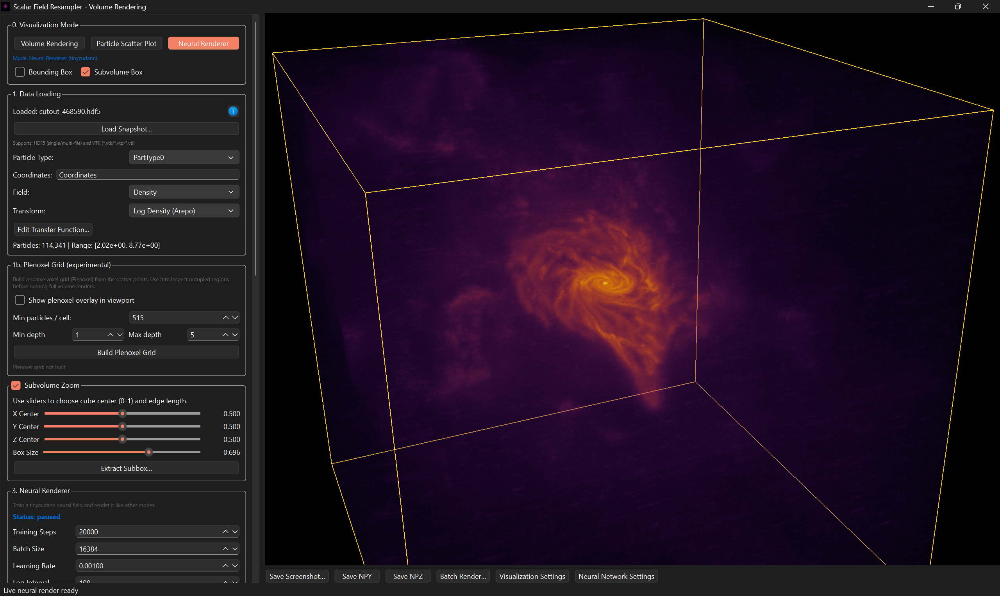

# VolPath

## Application Image

  
   
  <em>Neural Volume Rendering: TNG100-1 Subhalo 468590 Gas Density</em>

## Overview

VolPath is a volume renderer designed for scalar-field reconstruction.
The motivation for this project came from working with unstructured point-cloud data and the need to resample it onto a grid for efficient volume rendering.

This repository provides several interpolation and reconstruction methods:
- Linear interpolation
- Nearest neighbor
- Gaussian RBF
- Natural neighbor
- Neural representation (with training, saving, and checkpointing through the UI)
- Octree-based reconstruction
- Point cloud visualization

The code is intended for scientific datasets and currently supports the hdf5 and vtk file formats.
The original goal was to visualize data from the IllustrisTNG simulation, and the application has been used to render a subhalo from the TNG100-1 dataset.
